# AI Math Tutor - Architecture Diagrams

**Project:** Socratic Learning Assistant  
**Date:** November 7, 2025  
**Version:** 1.0  
**Tech Stack:** Next.js + OpenAI + Vercel AI SDK

This document provides comprehensive architecture diagrams for the AI Math Tutor system using Mermaid syntax.

---

## Table of Contents
1. [High-Level System Architecture](#high-level-system-architecture)
2. [Vercel AI SDK Integration](#vercel-ai-sdk-integration)
3. [Component Architecture](#component-architecture)
4. [Data Flow Diagrams](#data-flow-diagrams)
5. [Conversation Flow](#conversation-flow)
6. [State Management](#state-management)
7. [API Integration Architecture](#api-integration-architecture)
8. [File Structure](#file-structure)
9. [Deployment Architecture](#deployment-architecture)

---

## High-Level System Architecture

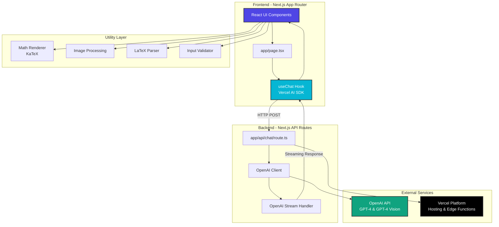

---

## Vercel AI SDK Integration

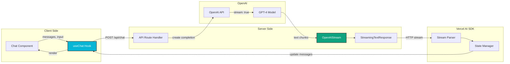

---

## Component Architecture

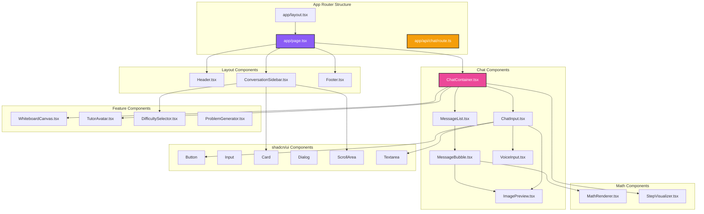

---

## Data Flow Diagrams

### Text Input Flow with Vercel AI SDK

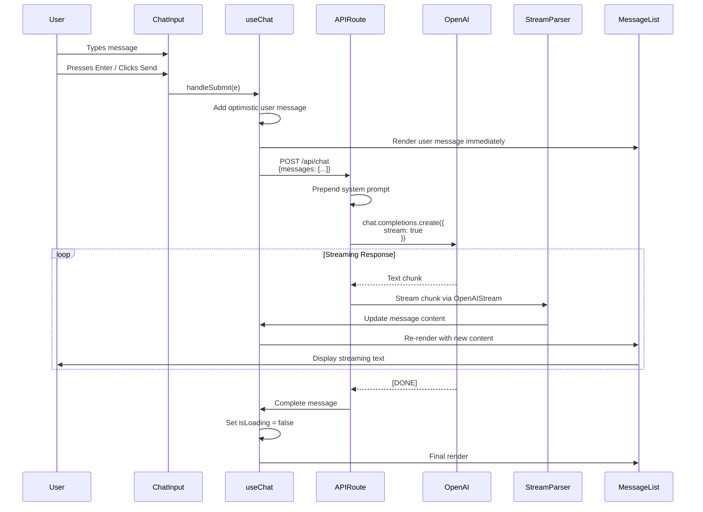

### Image Upload Flow with OpenAI Vision

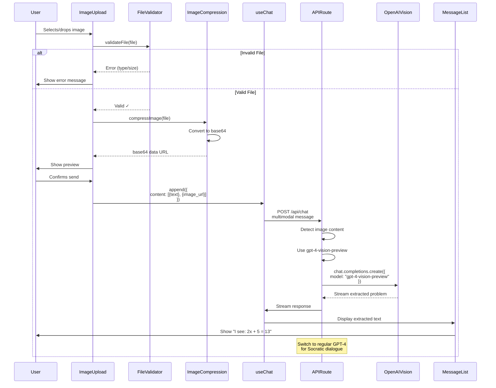

### Voice Input Flow

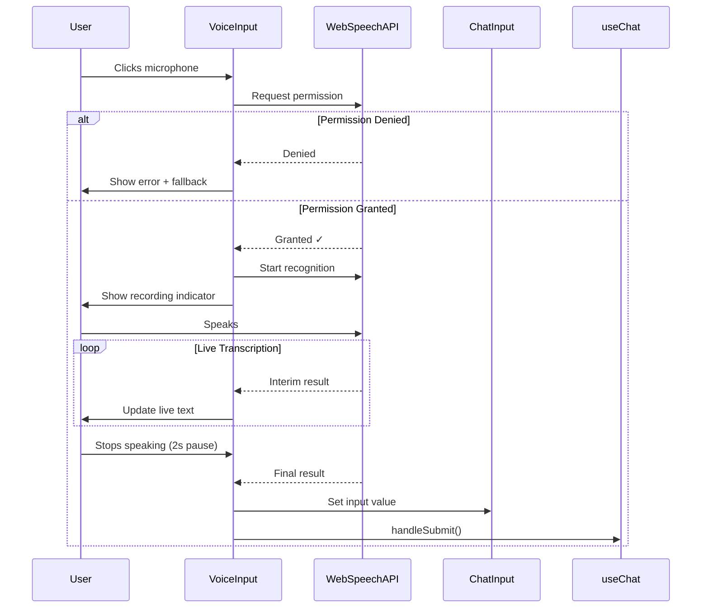

---

## Conversation Flow

### Socratic Method State Machine

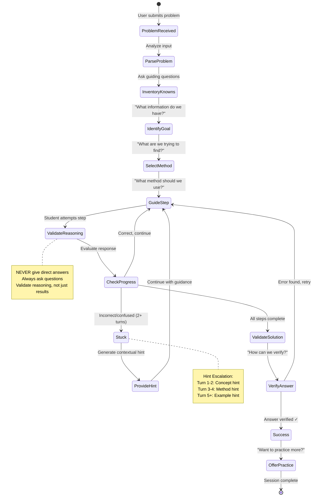

### Streaming Response State

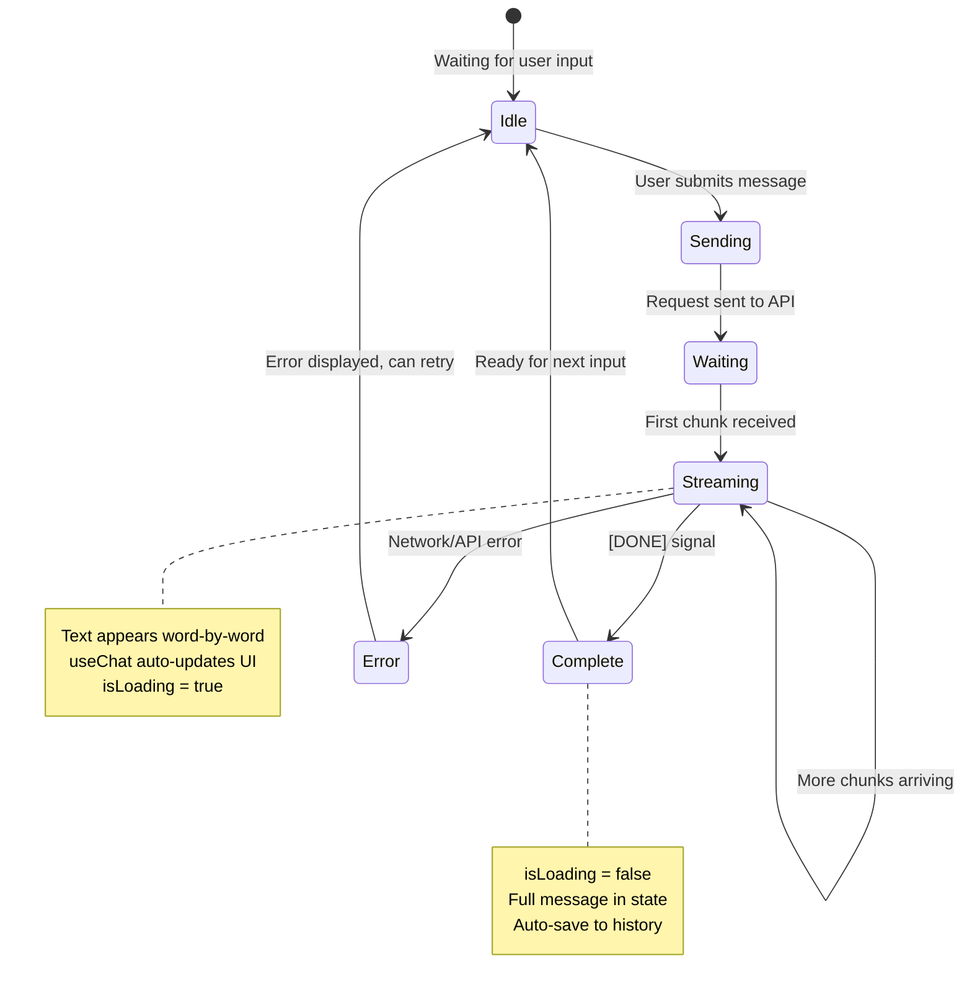

---

## State Management

### Vercel AI SDK State Flow

```mermaid
graph TB
    subgraph "useChat Hook State"
        Messages[messages: Message<br/>id, role, content]
        Input[input: string]
        IsLoading[isLoading: boolean]
        Error[error: Error | null]
    end
    
    subgraph "Hook Methods"
        HandleSubmit[handleSubmit]
        HandleInputChange[handleInputChange]
        Append[append]
        Reload[reload]
        Stop[stop]
        SetMessages[setMessages]
    end
    
    subgraph "Component State"
        LocalState[Local UI State<br/>selectedImage<br/>isRecording<br/>showWhiteboard]
        LocalStorage[localStorage<br/>Conversation History<br/>User Preferences]
    end
    
    Messages --> HandleSubmit
    Input --> HandleSubmit
    HandleSubmit -->|Updates| Messages
    HandleSubmit -->|Sets| IsLoading
    
    HandleInputChange -->|Updates| Input
    Append -->|Adds| Messages
    
    LocalState -->|Syncs with| Messages
    Messages -->|Persists to| LocalStorage
    
    style Messages fill:#ec4899,stroke:#333,stroke-width:2px,color:#fff
    style HandleSubmit fill:#06b6d4,stroke:#333,stroke-width:2px,color:#fff
```

### Data Persistence Flow

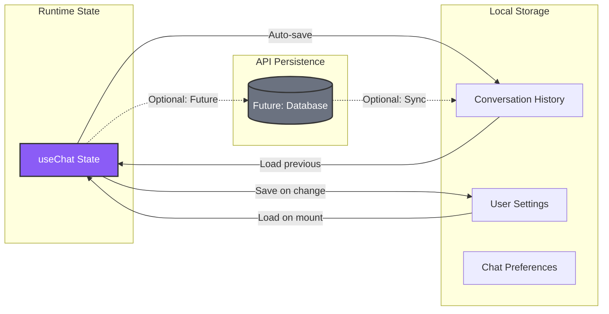

---

## API Integration Architecture

### OpenAI API Route Structure

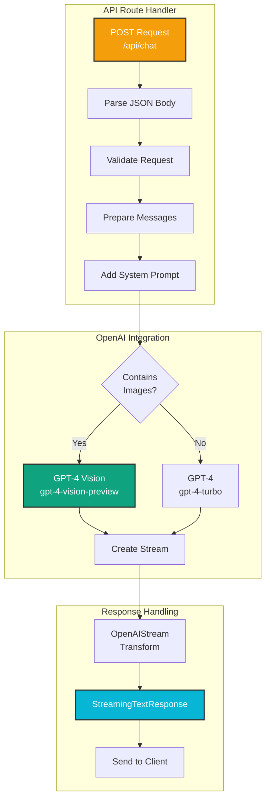

### Request/Response Flow

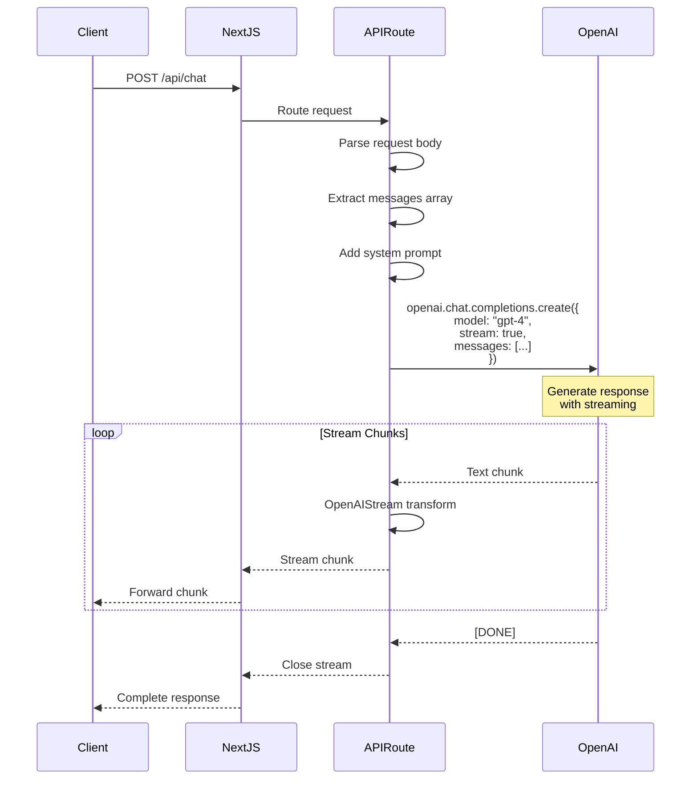

---

## File Structure

### Next.js App Directory Structure

```mermaid
graph TB
    subgraph "Root"
        Root[/]
    end
    
    subgraph "App Router"
        App[app/]
        Layout[layout.tsx]
        Page[page.tsx]
        API[api/]
        ChatRoute[chat/route.ts]
    end
    
    subgraph "Components"
        Comp[components/]
        Chat[chat/]
        UILib[ui/]
        LayoutComp[layout/]
        Math[math/]
        Features[features/]
    end
    
    subgraph "Library Code"
        Lib[lib/]
        OpenAIConfig[openai.ts]
        Utils[utils.ts]
        Vision[vision.ts]
    end
    
    subgraph "Configuration"
        Types[types/]
        Prompts[prompts/]
        Hooks[hooks/]
        Styles[styles/]
    end
    
    subgraph "Public Assets"
        Public[public/]
        Images[images/]
        Icons[icons/]
    end
    
    Root --> App
    Root --> Comp
    Root --> Lib
    Root --> Types
    Root --> Public
    
    App --> Layout
    App --> Page
    App --> API
    API --> ChatRoute
    
    Comp --> Chat
    Comp --> UILib
    Comp --> LayoutComp
    Comp --> Math
    Comp --> Features
    
    Lib --> OpenAIConfig
    Lib --> Utils
    Lib --> Vision
    
    Types --> Prompts
    Types --> Hooks
    Types --> Styles
    
    Public --> Images
    Public --> Icons
    
    style App fill:#8b5cf6,stroke:#333,stroke-width:2px,color:#fff
    style ChatRoute fill:#f59e0b,stroke:#333,stroke-width:2px,color:#fff
    style OpenAIConfig fill:#10a37f,stroke:#333,stroke-width:2px,color:#fff
```

### Detailed File Organization

```
ai-math-tutor/
├── app/
│   ├── layout.tsx                 # Root layout with providers
│   ├── page.tsx                   # Main chat page (uses useChat)
│   ├── globals.css                # Global styles + Tailwind
│   └── api/
│       └── chat/
│           └── route.ts           # OpenAI API route with streaming
│
├── components/
│   ├── chat/
│   │   ├── ChatContainer.tsx      # Main chat wrapper
│   │   ├── MessageList.tsx        # Renders message array
│   │   ├── MessageBubble.tsx      # Individual message
│   │   ├── ChatInput.tsx          # Input with send button
│   │   ├── ImagePreview.tsx       # Image upload preview
│   │   └── VoiceInput.tsx         # Voice recording
│   │
│   ├── math/
│   │   ├── MathRenderer.tsx       # LaTeX rendering
│   │   └── StepVisualizer.tsx     # Animated steps
│   │
│   ├── features/
│   │   ├── WhiteboardCanvas.tsx   # Drawing canvas
│   │   ├── TutorAvatar.tsx        # Animated avatar
│   │   └── DifficultySelector.tsx # Level picker
│   │
│   ├── layout/
│   │   ├── Header.tsx             # App header
│   │   ├── Sidebar.tsx            # Conversation list
│   │   └── Footer.tsx             # App footer
│   │
│   └── ui/                        # shadcn/ui components
│       ├── button.tsx
│       ├── input.tsx
│       ├── card.tsx
│       └── ...
│
├── lib/
│   ├── openai.ts                  # OpenAI client config
│   ├── utils.ts                   # Utility functions
│   └── vision.ts                  # Vision processing helpers
│
├── types/
│   ├── conversation.ts            # Message types
│   └── index.ts                   # Shared types
│
├── prompts/
│   ├── socraticPrompt.ts          # System prompt
│   ├── visionPrompt.ts            # Image extraction prompt
│   └── difficultyModes.ts         # Level-specific prompts
│
├── hooks/
│   ├── useLocalStorage.ts         # Persist conversations
│   └── useVoice.ts                # Voice input hook
│
├── utils/
│   ├── imageToBase64.ts           # Image conversion
│   ├── latexParser.ts             # Parse LaTeX
│   └── fileValidator.ts           # File validation
│
├── public/
│   └── images/
│       └── avatar/                # Avatar assets
│
├── .env.local                     # Environment variables
├── next.config.js                 # Next.js config
├── tailwind.config.js             # Tailwind config
├── tsconfig.json                  # TypeScript config
└── package.json                   # Dependencies
```

---

## Deployment Architecture

### Vercel Deployment Flow

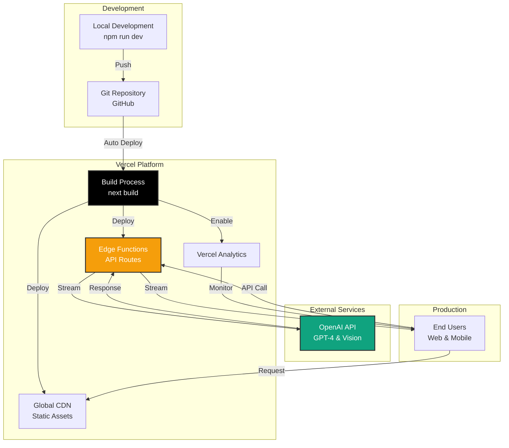

### Edge Function Architecture

```mermaid
graph LR
    subgraph "User Request"
        Browser[Browser/Mobile]
    end
    
    subgraph "Vercel Edge Network"
        Edge1[Edge Node - US West]
        Edge2[Edge Node - US East]
        Edge3[Edge Node - Europe]
    end
    
    subgraph "API Routes"
        ChatAPI[/api/chat<br/>Edge Function]
    end
    
    subgraph "OpenAI"
        OpenAI[OpenAI API<br/>Streaming Endpoint]
    end
    
    Browser -->|Routed to nearest| Edge1
    Browser -->|Routed to nearest| Edge2
    Browser -->|Routed to nearest| Edge3
    
    Edge1 --> ChatAPI
    Edge2 --> ChatAPI
    Edge3 --> ChatAPI
    
    ChatAPI -->|HTTPS| OpenAI
    OpenAI -->|Stream| ChatAPI
    ChatAPI -->|Stream| Edge1
    ChatAPI -->|Stream| Edge2
    ChatAPI -->|Stream| Edge3
    
    Edge1 -->|Stream| Browser
    Edge2 -->|Stream| Browser
    Edge3 -->|Stream| Browser
    
    style Edge1 fill:#000,stroke:#333,stroke-width:2px,color:#fff
    style Edge2 fill:#000,stroke:#333,stroke-width:2px,color:#fff
    style Edge3 fill:#000,stroke:#333,stroke-width:2px,color:#fff
    style OpenAI fill:#10a37f,stroke:#333,stroke-width:2px,color:#fff
```

---

## Technology Stack Diagram

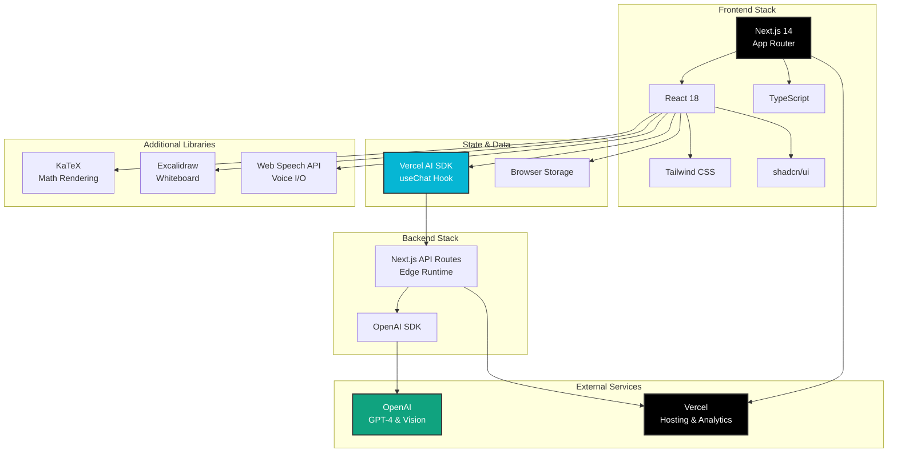

---

## Security & Authentication Flow

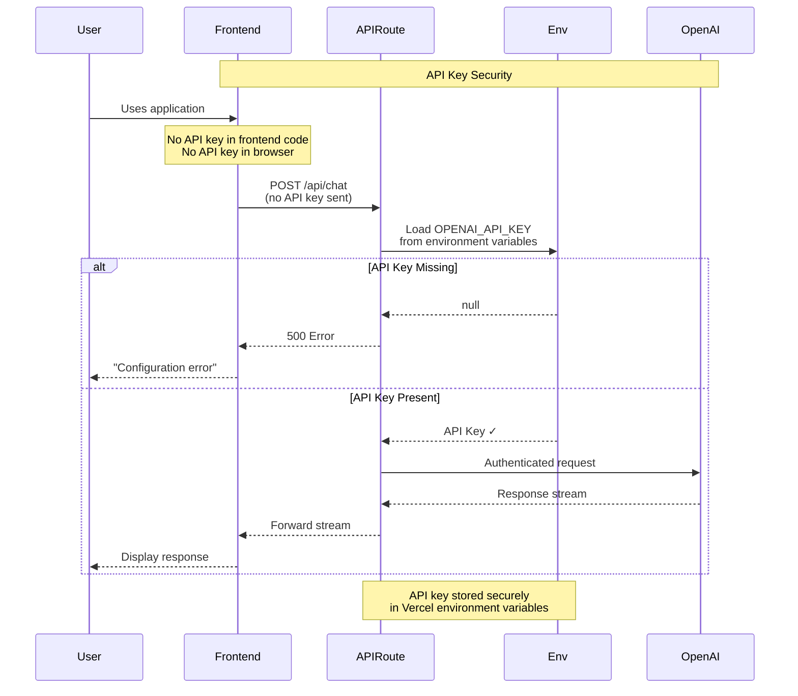

---

## Performance Optimization

```mermaid
graph TB
    subgraph "Optimization Strategies"
        Streaming[Response Streaming<br/>Immediate feedback]
        EdgeFunc[Edge Functions<br/>Low latency]
        Caching[Static Asset Caching<br/>Fast page loads]
        LazyLoad[Lazy Loading<br/>Code splitting]
        ImageOpt[Image Optimization<br/>Compression]
    end
    
    subgraph "Metrics"
        TTFB[Time to First Byte<br/>&lt; 100ms]
        FCP[First Contentful Paint<br/>&lt; 1.5s]
        LCP[Largest Contentful Paint<br/>&lt; 2.5s]
        TTI[Time to Interactive<br/>&lt; 3s]
    end
    
    subgraph "Implementation"
        NextImage[next/image<br/>Automatic optimization]
        DynamicImport[Dynamic imports<br/>React.lazy()]
        StreamText[Streaming responses<br/>Vercel AI SDK]
    end
    
    Streaming --> TTFB
    EdgeFunc --> TTFB
    Caching --> FCP
    LazyLoad --> LCP
    ImageOpt --> LCP
    
    NextImage --> ImageOpt
    DynamicImport --> LazyLoad
    StreamText --> Streaming
    
    TTFB --> TTI
    FCP --> TTI
    LCP --> TTI
    
    style Streaming fill:#06b6d4,stroke:#333,stroke-width:2px,color:#fff
    style EdgeFunc fill:#000,stroke:#333,stroke-width:2px,color:#fff
```

---

## Error Handling Architecture

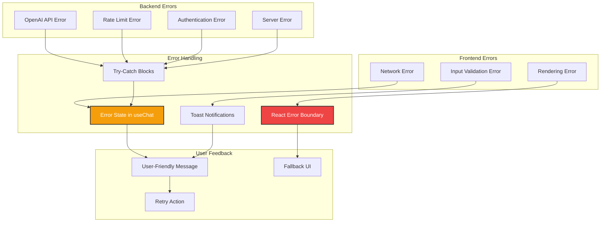

---

## Monitoring & Analytics

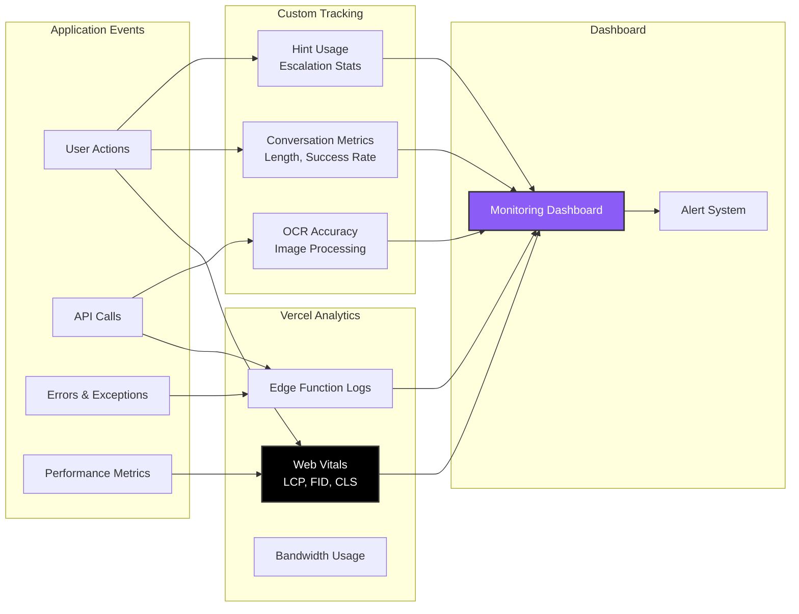

---

## Summary

This architecture leverages:

1. **Next.js 14 App Router** - Modern React framework with file-based routing
2. **Vercel AI SDK** - Seamless streaming chat integration with `useChat` hook
3. **OpenAI GPT-4** - Powerful LLM for Socratic teaching
4. **OpenAI Vision** - Image-to-text extraction for problem input
5. **Edge Functions** - Low-latency API routes deployed globally
6. **Streaming Responses** - Real-time text streaming for better UX
7. **TypeScript** - Type safety throughout the stack
8. **Tailwind + shadcn/ui** - Beautiful, consistent UI components

### Key Benefits:
- ✅ **Zero Backend Configuration** - API routes handle everything
- ✅ **Automatic Streaming** - Vercel AI SDK manages streaming state
- ✅ **Global Performance** - Edge functions deployed worldwide
- ✅ **Type Safety** - End-to-end TypeScript
- ✅ **Easy Deployment** - Push to GitHub, auto-deploy to Vercel
- ✅ **Scalable** - Serverless architecture scales automatically

---

*Last Updated: November 7, 2025*  
*Tech Stack: Next.js + OpenAI + Vercel AI SDK*
