# Gandalf - Architecture

**Project:** AI Math Tutor with Socratic Learning
**Last Updated:** March 2026
**Tech Stack:** Next.js 16 + React 19 + OpenAI GPT-4 Turbo + Vercel AI SDK 5.x

---

## Table of Contents

1. [High-Level System Architecture](#high-level-system-architecture)
2. [Component Architecture](#component-architecture)
3. [Data Flow Diagrams](#data-flow-diagrams)
4. [State Management](#state-management)
5. [API Routes](#api-routes)
6. [Socratic Dialogue Flow](#socratic-dialogue-flow)
7. [Hint System](#hint-system)
8. [Internationalization](#internationalization)
9. [File Structure](#file-structure)
10. [Deployment Architecture](#deployment-architecture)

---

## High-Level System Architecture

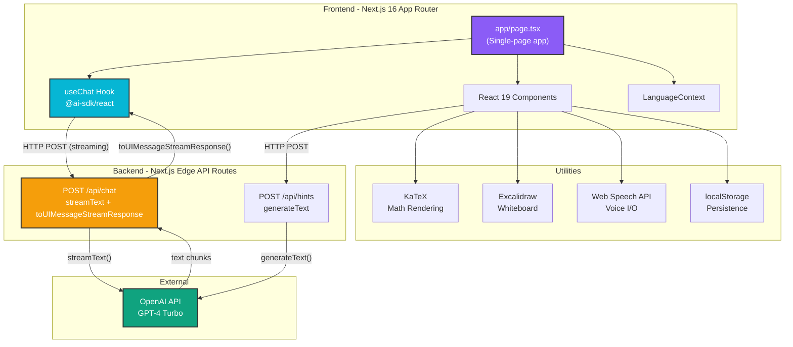
```mermaid
graph TB
    subgraph "Frontend - Next.js 16 App Router"
        Page["app/page.tsx<br/>(Single-page app)"]
        UseChat["useChat Hook<br/>@ai-sdk/react"]
        Components["React 19 Components"]
        Context["LanguageContext"]
    end

    subgraph "Backend - Next.js Edge API Routes"
        ChatAPI["POST /api/chat<br/>streamText + toUIMessageStreamResponse"]
        HintsAPI["POST /api/hints<br/>generateText"]
    end

    subgraph "Utilities"
        KaTeX["KaTeX<br/>Math Rendering"]
        Excalidraw["Excalidraw<br/>Whiteboard"]
        WebSpeech["Web Speech API<br/>Voice I/O"]
        Storage["localStorage<br/>Persistence"]
    end

    subgraph "External"
        OpenAI["OpenAI API<br/>GPT-4 Turbo"]
    end

    Page --> UseChat
    Page --> Components
    Page --> Context
    UseChat -->|"HTTP POST (streaming)"| ChatAPI
    Components -->|"HTTP POST"| HintsAPI
    ChatAPI -->|"streamText()"| OpenAI
    HintsAPI -->|"generateText()"| OpenAI
    OpenAI -->|"text chunks"| ChatAPI
    ChatAPI -->|"toUIMessageStreamResponse()"| UseChat
    Components --> KaTeX
    Components --> Excalidraw
    Components --> WebSpeech
    Components --> Storage

    style Page fill:#8b5cf6,stroke:#333,stroke-width:2px,color:#fff
    style UseChat fill:#06b6d4,stroke:#333,stroke-width:2px,color:#fff
    style OpenAI fill:#10a37f,stroke:#333,stroke-width:2px,color:#fff
    style ChatAPI fill:#f59e0b,stroke:#333,stroke-width:2px,color:#fff
```

---

## Component Architecture

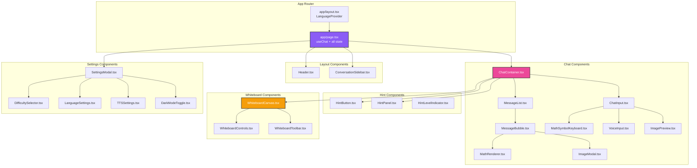
```mermaid
graph TB
    subgraph "App Router"
        Layout["app/layout.tsx<br/>LanguageProvider"]
        MainPage["app/page.tsx<br/>useChat + all state"]
    end

    subgraph "Layout Components"
        Header["Header.tsx"]
        Sidebar["ConversationSidebar.tsx"]
    end

    subgraph "Chat Components"
        ChatContainer["ChatContainer.tsx"]
        MessageList["MessageList.tsx"]
        MessageBubble["MessageBubble.tsx"]
        ChatInput["ChatInput.tsx"]
        MathRenderer["MathRenderer.tsx"]
        MathKeyboard["MathSymbolKeyboard.tsx"]
        VoiceInput["VoiceInput.tsx"]
        ImagePreview["ImagePreview.tsx"]
        ImageModal["ImageModal.tsx"]
    end

    subgraph "Hint Components"
        HintButton["HintButton.tsx"]
        HintPanel["HintPanel.tsx"]
        HintIndicator["HintLevelIndicator.tsx"]
    end

    subgraph "Whiteboard Components"
        WhiteboardCanvas["WhiteboardCanvas.tsx"]
        WhiteboardControls["WhiteboardControls.tsx"]
        WhiteboardToolbar["WhiteboardToolbar.tsx"]
    end

    subgraph "Settings Components"
        SettingsModal["SettingsModal.tsx"]
        DifficultySelector["DifficultySelector.tsx"]
        LanguageSettings["LanguageSettings.tsx"]
        TTSSettings["TTSSettings.tsx"]
        DarkModeToggle["DarkModeToggle.tsx"]
    end

    Layout --> MainPage
    MainPage --> Header
    MainPage --> Sidebar
    MainPage --> ChatContainer
    MainPage --> SettingsModal

    ChatContainer --> MessageList
    ChatContainer --> ChatInput
    ChatContainer --> HintButton
    ChatContainer --> HintPanel
    ChatContainer --> WhiteboardCanvas

    MessageList --> MessageBubble
    MessageBubble --> MathRenderer
    MessageBubble --> ImageModal

    ChatInput --> VoiceInput
    ChatInput --> ImagePreview
    ChatInput --> MathKeyboard

    WhiteboardCanvas --> WhiteboardControls
    WhiteboardCanvas --> WhiteboardToolbar

    SettingsModal --> DifficultySelector
    SettingsModal --> LanguageSettings
    SettingsModal --> TTSSettings
    SettingsModal --> DarkModeToggle

    style MainPage fill:#8b5cf6,stroke:#333,stroke-width:2px,color:#fff
    style ChatContainer fill:#ec4899,stroke:#333,stroke-width:2px,color:#fff
    style WhiteboardCanvas fill:#f59e0b,stroke:#333,stroke-width:2px,color:#fff
```

---

## Data Flow Diagrams

### Text Chat Flow

```mermaid
sequenceDiagram
    participant User
    participant page.tsx
    participant useChat
    participant /api/chat
    participant OpenAI

    User->>page.tsx: Types message, presses Enter
    page.tsx->>page.tsx: handleSubmit() builds message parts
    page.tsx->>useChat: sendMessage({ role, parts })
    useChat->>useChat: Optimistic UI update

    useChat->>/api/chat: POST { messages, difficulty, language, whiteboardData }
    /api/chat->>/api/chat: getSocraticPrompt(language, difficulty)
    /api/chat->>/api/chat: Append whiteboard context if present
    /api/chat->>/api/chat: convertToModelMessages(last 15 messages)
    /api/chat->>OpenAI: streamText({ model: gpt-4-turbo, system, messages })

    loop Streaming
        OpenAI-->>/api/chat: text chunk
        /api/chat-->>useChat: toUIMessageStreamResponse()
        useChat-->>page.tsx: Re-render MessageList
    end

    OpenAI-->>/api/chat: [DONE]
    page.tsx->>page.tsx: Auto-save to localStorage
```

### Image Upload Flow

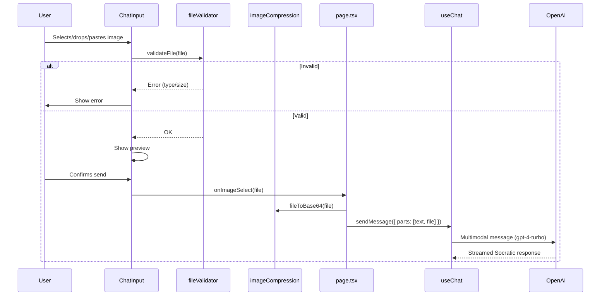
```mermaid
sequenceDiagram
    participant User
    participant ChatInput
    participant fileValidator
    participant imageCompression
    participant page.tsx
    participant useChat
    participant OpenAI

    User->>ChatInput: Selects/drops/pastes image
    ChatInput->>fileValidator: validateFile(file)

    alt Invalid
        fileValidator-->>ChatInput: Error (type/size)
        ChatInput->>User: Show error
    else Valid
        fileValidator-->>ChatInput: OK
        ChatInput->>ChatInput: Show preview
        User->>ChatInput: Confirms send
        ChatInput->>page.tsx: onImageSelect(file)
        page.tsx->>imageCompression: fileToBase64(file)
        page.tsx->>useChat: sendMessage({ parts: [text, file] })
        useChat->>OpenAI: Multimodal message (gpt-4-turbo)
        OpenAI-->>useChat: Streamed Socratic response
    end
```

### Whiteboard Flow

```mermaid
sequenceDiagram
    participant User
    participant WhiteboardCanvas
    participant Excalidraw
    participant page.tsx
    participant /api/chat
    participant OpenAI

    User->>WhiteboardCanvas: Draws on canvas
    WhiteboardCanvas->>Excalidraw: Element changes
    Excalidraw->>page.tsx: onWhiteboardElementsChange(elements)
    page.tsx->>page.tsx: Save to localStorage per conversation

    User->>page.tsx: Sends message
    page.tsx->>Excalidraw: exportToBlob() screenshot
    page.tsx->>page.tsx: Convert screenshot to base64
    page.tsx->>page.tsx: Serialize elements via whiteboardToLLM

    page.tsx->>/api/chat: { messages (with image part), whiteboardData }
    /api/chat->>/api/chat: Inject whiteboard context into system prompt
    /api/chat->>OpenAI: streamText() with multimodal message
    OpenAI-->>/api/chat: Socratic response referencing drawings
```

### Voice Flow

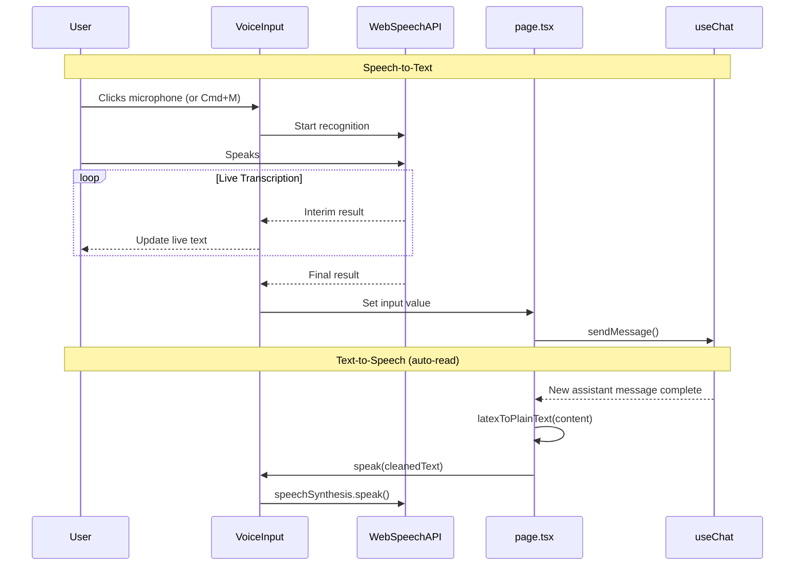
```mermaid
sequenceDiagram
    participant User
    participant VoiceInput
    participant WebSpeechAPI
    participant page.tsx
    participant useChat

    Note over User,useChat: Speech-to-Text
    User->>VoiceInput: Clicks microphone (or Cmd+M)
    VoiceInput->>WebSpeechAPI: Start recognition
    User->>WebSpeechAPI: Speaks
    loop Live Transcription
        WebSpeechAPI-->>VoiceInput: Interim result
        VoiceInput-->>User: Update live text
    end
    WebSpeechAPI-->>VoiceInput: Final result
    VoiceInput->>page.tsx: Set input value
    page.tsx->>useChat: sendMessage()

    Note over User,useChat: Text-to-Speech (auto-read)
    useChat-->>page.tsx: New assistant message complete
    page.tsx->>page.tsx: latexToPlainText(content)
    page.tsx->>VoiceInput: speak(cleanedText)
    VoiceInput->>WebSpeechAPI: speechSynthesis.speak()
```

---

## State Management

### State Architecture

The app uses no external state management library. All state lives in `app/page.tsx` and flows down via props.

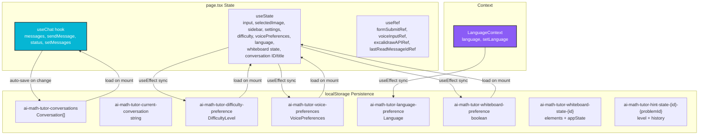
```mermaid
graph TB
    subgraph "page.tsx State"
        UseChatHook["useChat hook<br/>messages, sendMessage, status, setMessages"]
        LocalState["useState<br/>input, selectedImage, sidebar, settings,<br/>difficulty, voicePreferences, language,<br/>whiteboard state, conversation ID/title"]
        Refs["useRef<br/>formSubmitRef, voiceInputRef,<br/>excalidrawAPIRef, lastReadMessageIdRef"]
    end

    subgraph "Context"
        LangContext["LanguageContext<br/>language, setLanguage"]
    end

    subgraph "localStorage Persistence"
        Conversations["ai-math-tutor-conversations<br/>Conversation[]"]
        CurrentId["ai-math-tutor-current-conversation<br/>string"]
        Difficulty["ai-math-tutor-difficulty-preference<br/>DifficultyLevel"]
        Voice["ai-math-tutor-voice-preferences<br/>VoicePreferences"]
        Lang["ai-math-tutor-language-preference<br/>Language"]
        WBPref["ai-math-tutor-whiteboard-preference<br/>boolean"]
        WBState["ai-math-tutor-whiteboard-state-{id}<br/>elements + appState"]
        HintState["ai-math-tutor-hint-state-{id}-{problemId}<br/>level + history"]
    end

    UseChatHook -->|"auto-save on change"| Conversations
    LocalState -->|"useEffect sync"| Difficulty
    LocalState -->|"useEffect sync"| Voice
    LocalState -->|"useEffect sync"| WBPref
    LangContext -->|"useEffect sync"| Lang

    Conversations -->|"load on mount"| UseChatHook
    Difficulty -->|"load on mount"| LocalState
    Voice -->|"load on mount"| LocalState
    WBPref -->|"load on mount"| LocalState

    style UseChatHook fill:#06b6d4,stroke:#333,stroke-width:2px,color:#fff
    style LangContext fill:#8b5cf6,stroke:#333,stroke-width:2px,color:#fff
```

### Data Flow Summary

```
User Input (text / image / voice / whiteboard)
  -> handleSubmit() in page.tsx
  -> Build message parts (text + optional file parts)
  -> sendMessage() via useChat hook
  -> POST /api/chat { messages, difficulty, language, whiteboardData }
  -> API builds system prompt (Socratic + whiteboard context)
  -> streamText() to OpenAI GPT-4 Turbo
  -> toUIMessageStreamResponse() back to client
  -> useChat updates messages state
  -> MessageList/MessageBubble re-render
  -> KaTeX renders math notation
  -> Auto-save conversation to localStorage
  -> Auto-read via TTS if enabled
```

---

## API Routes

### POST /api/chat (Edge Runtime)

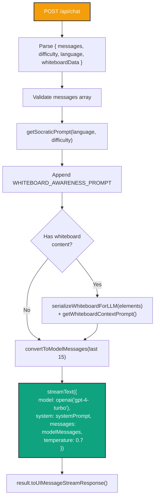
```mermaid
graph TB
    Request["POST /api/chat"] --> Parse["Parse { messages, difficulty, language, whiteboardData }"]
    Parse --> Validate["Validate messages array"]
    Validate --> SystemPrompt["getSocraticPrompt(language, difficulty)"]
    SystemPrompt --> WBAwareness["Append WHITEBOARD_AWARENESS_PROMPT"]
    WBAwareness --> WBCheck{Has whiteboard<br/>content?}

    WBCheck -->|Yes| WBSerialize["serializeWhiteboardForLLM(elements)<br/>+ getWhiteboardContextPrompt()"]
    WBCheck -->|No| Convert
    WBSerialize --> Convert["convertToModelMessages(last 15)"]

    Convert --> Stream["streamText({<br/>  model: openai('gpt-4-turbo'),<br/>  system: systemPrompt,<br/>  messages: modelMessages,<br/>  temperature: 0.7<br/>})"]
    Stream --> Response["result.toUIMessageStreamResponse()"]

    style Request fill:#f59e0b,stroke:#333,stroke-width:2px,color:#fff
    style Stream fill:#10a37f,stroke:#333,stroke-width:2px,color:#fff
```

### POST /api/hints (Edge Runtime)

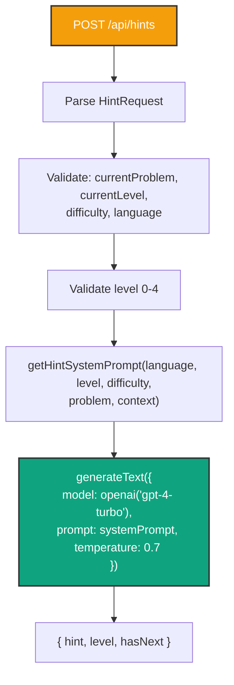
```mermaid
graph TB
    Request["POST /api/hints"] --> Parse["Parse HintRequest"]
    Parse --> ValidateFields["Validate: currentProblem, currentLevel,<br/>difficulty, language"]
    ValidateFields --> ValidateRange["Validate level 0-4"]
    ValidateRange --> BuildPrompt["getHintSystemPrompt(language, level, difficulty,<br/>problem, context)"]
    BuildPrompt --> Generate["generateText({<br/>  model: openai('gpt-4-turbo'),<br/>  prompt: systemPrompt,<br/>  temperature: 0.7<br/>})"]
    Generate --> BuildResponse["{ hint, level, hasNext }"]

    style Request fill:#f59e0b,stroke:#333,stroke-width:2px,color:#fff
    style Generate fill:#10a37f,stroke:#333,stroke-width:2px,color:#fff
```

---

## Socratic Dialogue Flow

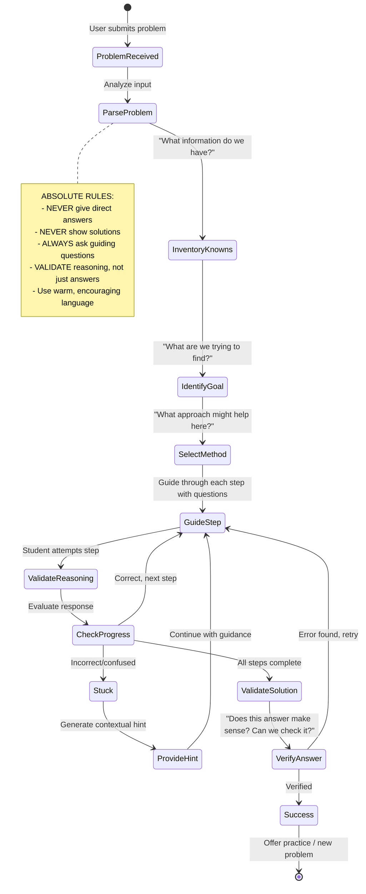
```mermaid
stateDiagram-v2
    [*] --> ProblemReceived: User submits problem
    ProblemReceived --> ParseProblem: Analyze input

    ParseProblem --> InventoryKnowns: "What information do we have?"
    InventoryKnowns --> IdentifyGoal: "What are we trying to find?"
    IdentifyGoal --> SelectMethod: "What approach might help here?"

    SelectMethod --> GuideStep: Guide through each step with questions
    GuideStep --> ValidateReasoning: Student attempts step

    ValidateReasoning --> CheckProgress: Evaluate response
    CheckProgress --> GuideStep: Correct, next step
    CheckProgress --> Stuck: Incorrect/confused
    CheckProgress --> ValidateSolution: All steps complete

    Stuck --> ProvideHint: Generate contextual hint
    ProvideHint --> GuideStep: Continue with guidance

    ValidateSolution --> VerifyAnswer: "Does this answer make sense? Can we check it?"
    VerifyAnswer --> Success: Verified
    VerifyAnswer --> GuideStep: Error found, retry

    Success --> [*]: Offer practice / new problem

    note right of ParseProblem
        ABSOLUTE RULES:
        - NEVER give direct answers
        - NEVER show solutions
        - ALWAYS ask guiding questions
        - VALIDATE reasoning, not just answers
        - Use warm, encouraging language
    end note
```

### System Prompt Architecture

Each system prompt is built from:

1. **Base Socratic prompt** — Core teaching rules and 6-stage dialogue flow (`prompts/socraticPrompts.ts`)
2. **Difficulty adaptation** — Adjusts language complexity, hint frequency, scaffolding amount
3. **Language localization** — Full prompt in target language (en, es, fr, de, zh, ja)
4. **Whiteboard awareness** — Static awareness text + dynamic context from serialized elements

---

## Hint System

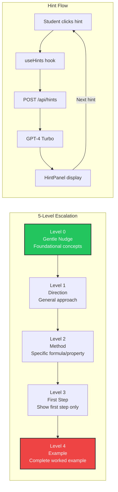
```mermaid
graph LR
    subgraph "5-Level Escalation"
        L0["Level 0<br/>Gentle Nudge<br/>Foundational concepts"]
        L1["Level 1<br/>Direction<br/>General approach"]
        L2["Level 2<br/>Method<br/>Specific formula/property"]
        L3["Level 3<br/>First Step<br/>Show first step only"]
        L4["Level 4<br/>Example<br/>Complete worked example"]
    end

    L0 --> L1 --> L2 --> L3 --> L4

    subgraph "Hint Flow"
        Student["Student clicks hint"]
        HintHook["useHints hook"]
        API["POST /api/hints"]
        GPT4["GPT-4 Turbo"]
        Panel["HintPanel display"]
    end

    Student --> HintHook
    HintHook --> API
    API --> GPT4
    GPT4 --> Panel
    Panel -->|"Next hint"| Student

    style L0 fill:#22c55e,stroke:#333,stroke-width:2px,color:#fff
    style L4 fill:#ef4444,stroke:#333,stroke-width:2px,color:#fff
```

Hints are:

- **Context-aware** — Use conversation history and current problem
- **Difficulty-aware** — Elementary gets more scaffolding, college gets less
- **Language-specific** — Generated in the student's selected language
- **Persisted** — Hint state saved per conversation + problem in localStorage

---

## Internationalization

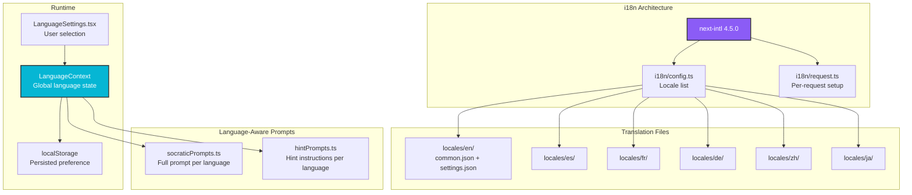
```mermaid
graph TB
    subgraph "i18n Architecture"
        NextIntl["next-intl 4.5.0"]
        Config["i18n/config.ts<br/>Locale list"]
        Request["i18n/request.ts<br/>Per-request setup"]
    end

    subgraph "Translation Files"
        EN["locales/en/<br/>common.json + settings.json"]
        ES["locales/es/"]
        FR["locales/fr/"]
        DE["locales/de/"]
        ZH["locales/zh/"]
        JA["locales/ja/"]
    end

    subgraph "Language-Aware Prompts"
        SocraticPrompts["socraticPrompts.ts<br/>Full prompt per language"]
        HintPrompts["hintPrompts.ts<br/>Hint instructions per language"]
    end

    subgraph "Runtime"
        LangContext["LanguageContext<br/>Global language state"]
        Settings["LanguageSettings.tsx<br/>User selection"]
        LocalStorage["localStorage<br/>Persisted preference"]
    end

    NextIntl --> Config
    NextIntl --> Request
    Config --> EN
    Config --> ES
    Config --> FR
    Config --> DE
    Config --> ZH
    Config --> JA

    Settings --> LangContext
    LangContext --> LocalStorage
    LangContext --> SocraticPrompts
    LangContext --> HintPrompts

    style NextIntl fill:#8b5cf6,stroke:#333,stroke-width:2px,color:#fff
    style LangContext fill:#06b6d4,stroke:#333,stroke-width:2px,color:#fff
```

Supported languages: English, Spanish, French, German, Chinese (Simplified), Japanese.

Both UI strings and AI system prompts are fully localized.

---

## File Structure

### Module Dependency Graph

```mermaid
graph TB
    subgraph "Entry Point"
        Layout["app/layout.tsx"]
        Page["app/page.tsx"]
    end

    subgraph "API Layer"
        ChatRoute["api/chat/route.ts"]
        HintsRoute["api/hints/route.ts"]
    end

    subgraph "Components"
        Chat["components/chat/*"]
        Hints["components/hints/*"]
        Whiteboard["components/whiteboard/*"]
        Settings["components/settings/*"]
        LayoutComp["components/layout/*"]
        UI["components/ui/*"]
    end

    subgraph "Hooks"
        UseHints["useHints"]
        UseKB["useKeyboardShortcuts"]
        UseVoice["useVoice + useVoiceRecognition + useTextToSpeech"]
        UseWB["useWhiteboardState"]
    end

    subgraph "Prompts"
        Socratic["socraticPrompts.ts"]
        HintPrompts["hintPrompts.ts"]
        WBPrompt["whiteboardPrompt.ts"]
    end

    subgraph "Utils"
        StorageMgr["storageManager.ts"]
        HintMgr["hintManager.ts"]
        LatexParser["latexParser.ts"]
        ImageUtils["imageToBase64.ts + imageCompression.ts"]
        FileVal["fileValidator.ts"]
        WBUtils["whiteboardStorage.ts + whiteboardToLLM.ts + whiteboardExport.ts"]
        PDFExport["pdfExport.ts"]
    end

    subgraph "Types"
        Types["conversation.ts, difficulty.ts, language.ts,<br/>voice.ts, hints.ts, whiteboard.ts"]
    end

    Layout --> Page
    Page --> Chat
    Page --> LayoutComp
    Page --> Settings
    Page --> UI
    Page --> UseKB
    Page --> StorageMgr

    Chat --> Hints
    Chat --> Whiteboard
    Chat --> UseVoice
    Chat --> UseHints

    ChatRoute --> Socratic
    ChatRoute --> WBPrompt
    HintsRoute --> HintPrompts

    Chat --> LatexParser
    Chat --> ImageUtils
    Chat --> FileVal
    Whiteboard --> WBUtils
    Hints --> HintMgr

    style Page fill:#8b5cf6,stroke:#333,stroke-width:2px,color:#fff
    style ChatRoute fill:#f59e0b,stroke:#333,stroke-width:2px,color:#fff
    style Chat fill:#ec4899,stroke:#333,stroke-width:2px,color:#fff
```

---

## Deployment Architecture

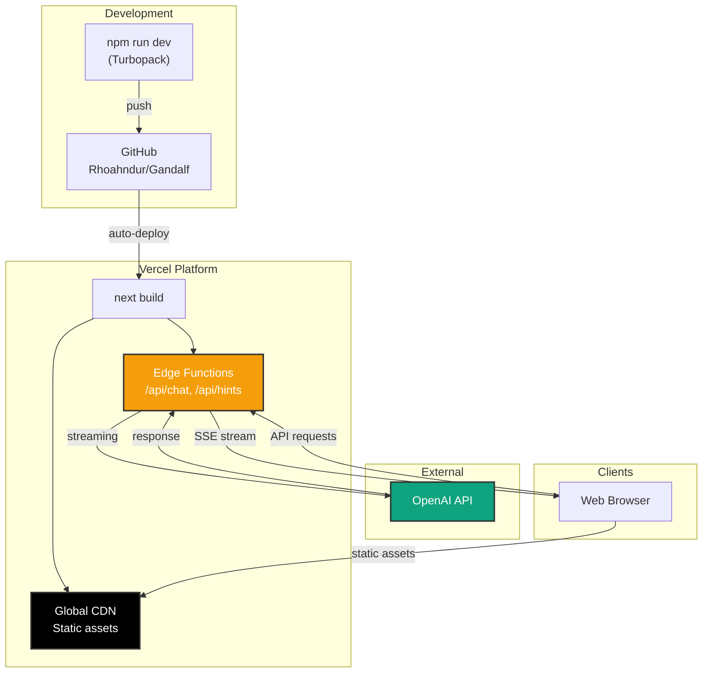
```mermaid
graph TB
    subgraph "Development"
        Dev["npm run dev<br/>(Turbopack)"]
        Git["GitHub<br/>Rhoahndur/Gandalf"]
    end

    subgraph "Vercel Platform"
        Build["next build"]
        Edge["Edge Functions<br/>/api/chat, /api/hints"]
        CDN["Global CDN<br/>Static assets"]
    end

    subgraph "External"
        OpenAI["OpenAI API"]
    end

    subgraph "Clients"
        Browser["Web Browser"]
    end

    Dev -->|push| Git
    Git -->|auto-deploy| Build
    Build --> Edge
    Build --> CDN

    Browser -->|static assets| CDN
    Browser -->|API requests| Edge
    Edge -->|streaming| OpenAI
    OpenAI -->|response| Edge
    Edge -->|SSE stream| Browser

    style Edge fill:#f59e0b,stroke:#333,stroke-width:2px,color:#fff
    style OpenAI fill:#10a37f,stroke:#333,stroke-width:2px,color:#fff
    style CDN fill:#000,stroke:#333,stroke-width:2px,color:#fff
```

### Security

- API key stored exclusively in environment variables (never in frontend code)
- All OpenAI requests proxied through server-side API routes
- No API key transmitted to the browser
- File uploads validated for type and size before processing
- Input validation on all API endpoint parameters

### Performance

- **Streaming responses** — First token visible in <1s via SSE
- **Edge Runtime** — API routes run at the network edge for low latency
- **Context limiting** — Only last 15 messages sent to API (prevents token overflow)
- **Image compression** — Uploads compressed to <1MB before base64 encoding
- **localStorage caching** — Conversations and preferences persist without network calls
- **Turbopack** — Fast development server rebuilds

---

## Technology Stack Summary

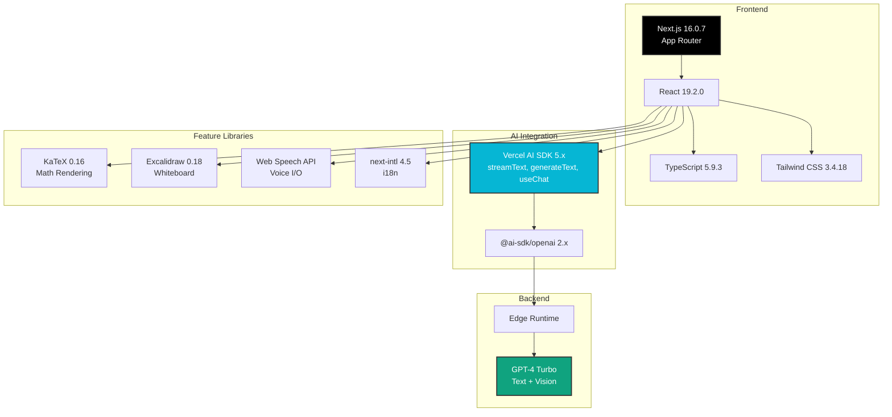
```mermaid
graph TB
    subgraph "Frontend"
        NextJS["Next.js 16.0.7<br/>App Router"]
        React["React 19.2.0"]
        TS["TypeScript 5.9.3"]
        Tailwind["Tailwind CSS 3.4.18"]
    end

    subgraph "AI Integration"
        AISDK["Vercel AI SDK 5.x<br/>streamText, generateText, useChat"]
        OpenAISDK["@ai-sdk/openai 2.x"]
    end

    subgraph "Feature Libraries"
        KaTeX["KaTeX 0.16<br/>Math Rendering"]
        ExcalidrawLib["Excalidraw 0.18<br/>Whiteboard"]
        WebSpeechLib["Web Speech API<br/>Voice I/O"]
        NextIntlLib["next-intl 4.5<br/>i18n"]
    end

    subgraph "Backend"
        EdgeRT["Edge Runtime"]
        GPT4T["GPT-4 Turbo<br/>Text + Vision"]
    end

    NextJS --> React
    React --> TS
    React --> Tailwind
    React --> AISDK
    AISDK --> OpenAISDK
    OpenAISDK --> EdgeRT
    EdgeRT --> GPT4T
    React --> KaTeX
    React --> ExcalidrawLib
    React --> WebSpeechLib
    React --> NextIntlLib

    style NextJS fill:#000,stroke:#333,stroke-width:2px,color:#fff
    style AISDK fill:#06b6d4,stroke:#333,stroke-width:2px,color:#fff
    style GPT4T fill:#10a37f,stroke:#333,stroke-width:2px,color:#fff
```
