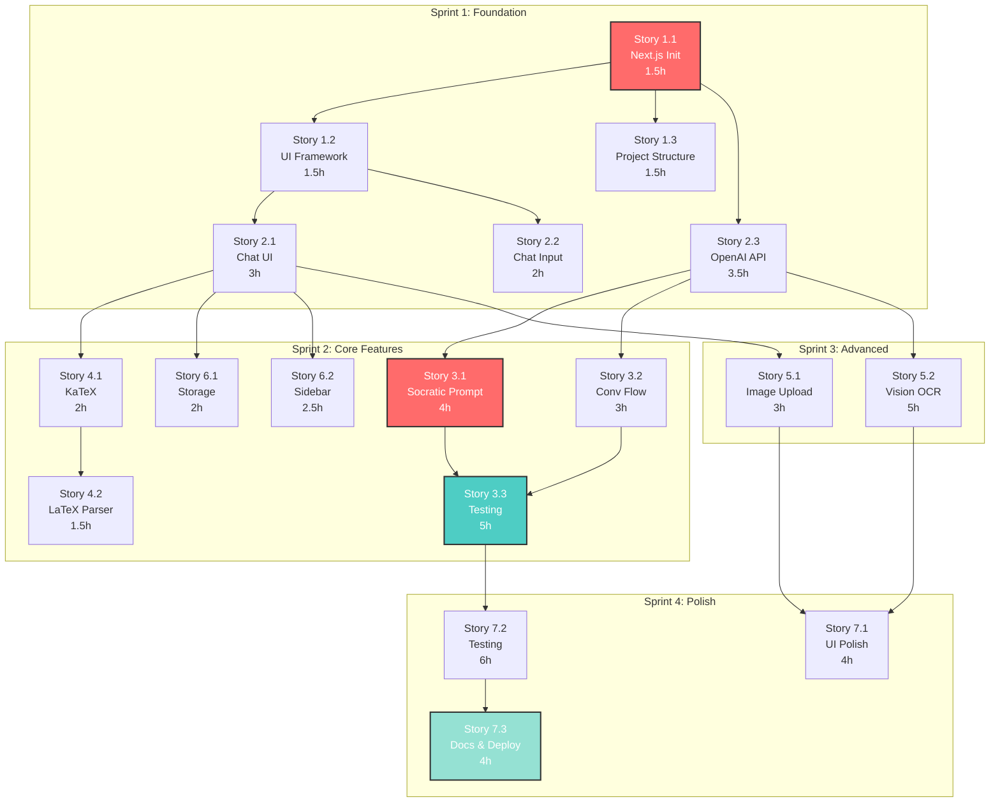

# Sprint Plan: Parallel Execution Strategy

**Project:** AI Math Tutor (Gandalf)
**Scope:** Core Features Only (PRs 1-11)
**Parallelization:** 4+ Concurrent Development Agents
**Total Estimated Time:** 40-47 hours work (10-12 calendar days with parallelization)
**Last Updated:** November 7, 2025

---

## Executive Summary

This sprint plan maximizes parallelization across **4-6 concurrent development agents** working on independent work streams. By strategically organizing stories into parallel tracks with minimal dependencies, we can complete the project in **10-12 calendar days** instead of 40+ sequential days.

---

## Table of Contents

1. [Sprint Overview](#sprint-overview)
2. [Agent Roles & Assignments](#agent-roles--assignments)
3. [Sprint Breakdown by Phase](#sprint-breakdown-by-phase)
4. [Dependency Graph](#dependency-graph)
5. [Daily Execution Plan](#daily-execution-plan)
6. [Risk Management](#risk-management)
7. [Communication & Coordination](#communication--coordination)

---

## Sprint Overview

### Timeline
- **Sprint 0 (Day 0):** Setup & Planning ✓ (Complete)
- **Sprint 1 (Days 1-2):** Foundation Phase
- **Sprint 2 (Days 3-5):** Core Features Phase
- **Sprint 3 (Days 6-8):** Advanced Features Phase
- **Sprint 4 (Days 9-12):** Polish & Launch Phase

### Total Story Points
- **7 Epics**
- **~20 User Stories** (key stories documented, others implicit in epics)
- **40-47 work hours** total
- **10-12 calendar days** with 4-6 agents

---

## Agent Roles & Assignments

### Agent Team Structure

#### **Agent #1: Frontend UI Specialist**
**Skills:** React, Next.js, Tailwind CSS, UX/UI
**Primary Responsibility:** Chat interface, components, styling
**Concurrent Capacity:** 2-3 stories at different stages

#### **Agent #2: Frontend Features Specialist**
**Skills:** React, File handling, Image processing, Client-side logic
**Primary Responsibility:** Image upload, math rendering, conversation UI
**Concurrent Capacity:** 2-3 stories

#### **Agent #3: Backend API Specialist**
**Skills:** Next.js API routes, OpenAI SDK, Streaming, Error handling
**Primary Responsibility:** API integration, OpenAI connection, streaming
**Concurrent Capacity:** 2-3 stories

#### **Agent #4: Prompt Engineering & Testing Specialist**
**Skills:** LLM prompting, QA, System testing
**Primary Responsibility:** Socratic prompts, comprehensive testing
**Concurrent Capacity:** Testing runs in background

#### **Agent #5: Full-Stack Utility (Optional)**
**Skills:** General full-stack, Documentation, DevOps
**Primary Responsibility:** Storage, persistence, deployment, documentation
**Concurrent Capacity:** 2 stories

#### **Agent #6: QA & Documentation (Optional)**
**Skills:** Testing, Documentation, Video production
**Primary Responsibility:** Final testing, docs, demo video
**Concurrent Capacity:** Parallel to dev work

---

## Sprint Breakdown by Phase

### **SPRINT 1: Foundation Phase (Days 1-2)**

**Goal:** Set up project infrastructure and basic chat UI
**Duration:** 2 days
**Total Hours:** 10-12 hours (parallel)

#### Parallel Work Streams

| Agent | Story | Time | Status |
|-------|-------|------|--------|
| **Agent #1** | Story 1.1: Next.js Initialization | 1.5h | Blocking |
| **Agent #1** → **Agent #2** | Story 1.2: UI Framework Setup | 1.5h | After 1.1 |
| **Agent #1** → **Agent #5** | Story 1.3: Project Structure | 1.5h | After 1.1 |
| **Agent #1** | Story 2.1: Chat UI Components | 3h | After 1.2 |
| **Agent #2** | Story 2.2: Chat Input | 2h | After 1.2 |
| **Agent #3** | Story 2.3: OpenAI API Integration | 3.5h | After 1.1 |

**Dependency Chain:**
```
Day 1:
  [Agent #1] Story 1.1 (1.5h) → BLOCKING
    ↓
  [Agent #1] Story 1.2 (1.5h) + [Agent #5] Story 1.3 (1.5h) → PARALLEL
    ↓
Day 2:
  [Agent #1] Story 2.1 (3h) + [Agent #2] Story 2.2 (2h) + [Agent #3] Story 2.3 (3.5h) → PARALLEL
```

**End of Sprint 1 Deliverables:**
- ✅ Next.js project running
- ✅ Chat UI functional
- ✅ OpenAI API connected
- ✅ Basic streaming chat working

---

### **SPRINT 2: Core Features Phase (Days 3-5)**

**Goal:** Implement Socratic engine and math rendering
**Duration:** 3 days
**Total Hours:** 17-19 hours (parallel)

#### Parallel Work Streams

| Agent | Story | Time | Dependencies | Day |
|-------|-------|------|--------------|-----|
| **Agent #4** | Story 3.1: Socratic Prompt | 4h | Sprint 1 done | Day 3 |
| **Agent #3** | Story 3.2: Conversation Flow | 3h | Parallel to 3.1 | Day 3 |
| **Agent #2** | Story 4.1: KaTeX Integration | 2h | Sprint 1 done | Day 3 |
| **Agent #2** | Story 4.2: LaTeX Parser | 1.5h | After 4.1 | Day 3 |
| **Agent #5** | Story 6.1: Storage Service | 2h | Sprint 1 done | Day 3-4 |
| **Agent #1** | Story 6.2: Conversation Sidebar | 2.5h | Sprint 1 done | Day 3-4 |
| **Agent #4** | Story 3.3: Problem Testing | 5h | After 3.1, 3.2 | Day 4-5 |

**Dependency Chain:**
```
Day 3 (Multiple Parallel Streams):
  [Agent #4] Story 3.1 (4h)     }
  [Agent #3] Story 3.2 (3h)     } → PARALLEL
  [Agent #2] Story 4.1 (2h) → 4.2 (1.5h)
  [Agent #5] Story 6.1 (2h)     }
  [Agent #1] Story 6.2 (2.5h)   } → PARALLEL

Day 4-5:
  [Agent #4] Story 3.3 (5h) → TESTING (after 3.1, 3.2 complete)
  [Agents #1-3] Bug fixes and refinements based on testing
```

**End of Sprint 2 Deliverables:**
- ✅ Socratic prompt working (NO direct answers)
- ✅ Math equations render with LaTeX
- ✅ Conversation persistence working
- ✅ 5+ problem types tested successfully

---

### **SPRINT 3: Advanced Features Phase (Days 6-8)**

**Goal:** Add image upload, OCR, and advanced features
**Duration:** 3 days
**Total Hours:** 10-12 hours (parallel)

#### Parallel Work Streams

| Agent | Story | Time | Dependencies | Day |
|-------|-------|------|--------------|-----|
| **Agent #2** | Story 5.1: Image Upload UI | 3h | Sprint 2 done | Day 6 |
| **Agent #3** | Story 5.2: Vision OCR | 5h | Sprint 2 done | Day 6-7 |
| **Agent #4** | Continue Testing | 2-3h | Parallel | Day 6-7 |
| **Agent #1** | UI Refinements | 2h | Parallel | Day 6-7 |
| **Agent #5** | Documentation Prep | 2h | Parallel | Day 7-8 |

**Dependency Chain:**
```
Day 6-7 (Parallel):
  [Agent #2] Story 5.1 (3h) → Image Upload UI
  [Agent #3] Story 5.2 (5h) → Vision API (can start parallel, integrates with 5.1)
  [Agent #4] Testing refinements (2-3h)
  [Agent #1] UI polish (2h)

Day 8:
  [All Agents] Integration testing
  [Agent #5] Start documentation
```

**End of Sprint 3 Deliverables:**
- ✅ Image upload working (drag-drop, file picker)
- ✅ OCR extracts printed equations (95%+ accuracy)
- ✅ OCR handles handwritten text (80%+ accuracy)
- ✅ All core features integrated

---

### **SPRINT 4: Polish & Launch Phase (Days 9-12)**

**Goal:** Final polish, comprehensive testing, deployment
**Duration:** 4 days
**Total Hours:** 12-14 hours (parallel)

#### Parallel Work Streams

| Agent | Story | Time | Dependencies | Day |
|-------|-------|------|--------------|-----|
| **Agent #1** | Story 7.1: UI Polish & Dark Mode | 4h | Sprint 3 done | Day 9 |
| **Agent #4** + **Agent #6** | Story 7.2: Comprehensive Testing | 6h | Sprint 3 done | Day 9-10 |
| **Agent #5** + **Agent #3** | Story 7.3: Documentation & Deployment | 4h | Testing done | Day 10-11 |
| **Agent #6** | Demo Video | 2h | Deployment done | Day 11-12 |

**Dependency Chain:**
```
Day 9-10 (Parallel):
  [Agent #1] Story 7.1: UI Polish (4h)
  [Agent #4 + #6] Story 7.2: Testing (6h) → Identifies bugs
  [All Agents] Bug fixes (2-3h)

Day 10-11:
  [Agent #5 + #3] Documentation (2h)
  [Agent #5 + #3] Deployment (2h)
  [Agent #4 + #6] Final production testing

Day 11-12:
  [Agent #6] Demo video recording (2h)
  [Agent #5] Final README polish
  [All] Launch readiness review
```

**End of Sprint 4 Deliverables:**
- ✅ Dark mode implemented
- ✅ All 10+ problem types passing tests
- ✅ Deployed to production (Vercel)
- ✅ Documentation complete
- ✅ Demo video recorded
- ✅ **PROJECT LAUNCH READY** 🚀

---

## Dependency Graph

### Visual Dependency Flow



### Critical Path

**Longest dependency chain (critical path):**
```
Story 1.1 (1.5h)
  → Story 1.2 (1.5h)
    → Story 2.1 (3h)
      → Story 4.1 (2h)
        → Story 4.2 (1.5h)
          → Story 5.1 (3h)
            → Story 7.1 (4h)
              → Story 7.2 (6h)
                → Story 7.3 (4h)

TOTAL CRITICAL PATH: 27.5 hours
```

**With 4-6 agents working in parallel on non-critical paths:**
- Actual calendar time: **~10-12 days** (8-hour workdays)
- If agents work longer days: **~8-10 days**

---

## Daily Execution Plan

### **Day 1: Project Bootstrap**

**Morning (4 hours):**
- Agent #1: Story 1.1 - Next.js Initialization (1.5h)
- Agent #1: Story 1.2 - UI Framework Setup (1.5h)
- Agent #5: Story 1.3 - Project Structure (1.5h) [parallel to 1.2]
- **Checkpoint:** Project runs, shadcn/ui installed

**Afternoon (3 hours):**
- Agents #1-3: Environment setup, API keys, testing
- Team sync: Review setup, plan tomorrow

**End of Day Deliverable:** Running Next.js app with basic structure

---

### **Day 2: Chat Interface & API**

**Morning (4 hours):**
- Agent #1: Story 2.1 - Chat UI Components (3h)
- Agent #2: Story 2.2 - Chat Input (2h) [parallel]
- Agent #3: Story 2.3 - OpenAI API Integration (3.5h) [parallel]

**Afternoon (4 hours):**
- Integration: Connect frontend to API
- Testing: Send messages, verify streaming
- **Checkpoint:** Working chat with OpenAI responses

**End of Day Deliverable:** Functional chat interface with streaming

---

### **Day 3: Socratic Engine & Math Rendering**

**Morning (4 hours):**
- Agent #4: Story 3.1 - Socratic Prompt (4h start, continues afternoon)
- Agent #3: Story 3.2 - Conversation Flow (3h)
- Agent #2: Story 4.1 - KaTeX Integration (2h)

**Afternoon (4 hours):**
- Agent #4: Story 3.1 continued + initial testing
- Agent #2: Story 4.2 - LaTeX Parser (1.5h)
- Agent #5: Story 6.1 - Storage Service (2h)
- Agent #1: Story 6.2 - Conversation Sidebar (2.5h)

**End of Day Deliverable:** Socratic prompt draft, math rendering working

---

### **Day 4: Testing & Refinement**

**All Day (8 hours):**
- Agent #4: Story 3.3 - Problem Type Testing (5h)
- Agents #1-3: Bug fixes based on testing feedback
- Agent #5: Continue sidebar and storage integration
- **Checkpoint:** 5+ problem types passing

**End of Day Deliverable:** Validated Socratic approach

---

### **Day 5: Testing Completion**

**Morning (4 hours):**
- Agent #4: Complete Story 3.3 testing
- All Agents: Critical bug fixes

**Afternoon (4 hours):**
- Integration testing: All features together
- **Checkpoint:** Core features stable

**End of Day Deliverable:** Solid core application

---

### **Day 6: Image Processing Start**

**All Day (8 hours):**
- Agent #2: Story 5.1 - Image Upload UI (3h)
- Agent #3: Story 5.2 - Vision OCR Integration (5h start)
- Agent #4: Additional testing with math rendering
- Agent #1: UI polish and refinements

**End of Day Deliverable:** Image upload UI complete

---

### **Day 7: OCR Completion**

**All Day (8 hours):**
- Agent #3: Complete Story 5.2 - Vision OCR
- Agent #2: Test image upload + OCR integration
- Agent #4: Test OCR accuracy with various images
- Agent #5: Begin documentation prep

**End of Day Deliverable:** Image OCR functional

---

### **Day 8: Integration & Testing**

**All Day (8 hours):**
- All Agents: Integration testing
- Bug fixes and refinements
- Agent #5: Documentation work
- **Checkpoint:** All features integrated

**End of Day Deliverable:** Feature-complete application

---

### **Day 9: Polish & Testing**

**All Day (8 hours):**
- Agent #1: Story 7.1 - UI Polish & Dark Mode (4h)
- Agents #4 + #6: Story 7.2 - Comprehensive Testing (6h start)
- Agents #2-3-5: Respond to testing issues

**End of Day Deliverable:** Polished UI, testing in progress

---

### **Day 10: Final Testing & Documentation**

**Morning (4 hours):**
- Agents #4 + #6: Complete comprehensive testing
- All Agents: Fix identified issues

**Afternoon (4 hours):**
- Agents #5 + #3: Story 7.3 - Documentation (2h)
- Agents #5 + #3: Deployment prep (2h)

**End of Day Deliverable:** Testing complete, docs ready

---

### **Day 11: Deployment**

**Morning (4 hours):**
- Agents #5 + #3: Deploy to Vercel
- All Agents: Production testing
- Bug fixes if needed

**Afternoon (4 hours):**
- Agent #6: Start demo video recording
- Agent #5: Final README polish
- **Checkpoint:** Production deployment successful

**End of Day Deliverable:** Live application

---

### **Day 12: Launch Preparation**

**Morning (4 hours):**
- Agent #6: Complete demo video
- Agent #5: Final documentation review
- All Agents: Launch readiness checklist

**Afternoon (2 hours):**
- Final team review
- **🚀 LAUNCH**

**End of Day Deliverable:** Launched project!

---

## Risk Management

### High-Risk Items

#### **Risk #1: Socratic Prompt Gives Direct Answers**
**Probability:** Medium
**Impact:** Critical (project failure)
**Mitigation:**
- Allocate extra time for Story 3.1 iteration
- Agent #4 dedicated to testing
- Have backup prompt strategies
- Budget 2-3 extra days if needed

#### **Risk #2: Agent Dependencies Cause Bottlenecks**
**Probability:** Medium
**Impact:** High (delays)
**Mitigation:**
- Daily standups to identify blockers
- Flexible agent reassignment
- Buffer time in schedule
- Pre-plan handoff points

#### **Risk #3: Integration Issues Between Parallel Streams**
**Probability:** Medium
**Impact:** Medium (rework needed)
**Mitigation:**
- Integration checkpoints every 2 days
- Shared TypeScript types
- API contract agreement upfront
- End-of-day syncs

### Medium-Risk Items

#### **Risk #4: OCR Accuracy Below Target**
**Probability:** Low-Medium
**Impact:** Medium
**Mitigation:**
- Test with real-world images early
- Vision API prompt iteration
- Fallback: manual entry option

#### **Risk #5: Performance Issues in Production**
**Probability:** Low
**Impact:** Medium
**Mitigation:**
- Load testing before launch
- Vercel analytics monitoring
- Edge function optimization

---

## Communication & Coordination

### Daily Standups (15 min)

**Time:** Start of day
**Attendees:** All agents
**Agenda:**
1. What I completed yesterday
2. What I'm working on today
3. Any blockers or dependencies

### Integration Checkpoints (30 min)

**Frequency:** Every 2 days (Days 2, 4, 6, 8, 10)
**Purpose:** Ensure all parallel work integrates correctly
**Actions:**
- Merge branches
- Test integrations
- Identify conflicts
- Adjust plan if needed

### End-of-Day Syncs (10 min)

**Time:** End of day
**Purpose:** Quick status update
**Format:** Async (Slack/Discord message)

---

## Story Index & File Locations

### Created Stories (Detailed)
- ✅ `docs/stories/story-1.1-nextjs-init.md`
- ✅ `docs/stories/story-2.3-openai-api.md`
- ✅ `docs/stories/story-3.1-socratic-prompt.md`

### Remaining Stories (Defined in Epics)
All other stories are documented in their respective epic files:
- `docs/_epic-1-project-foundation.md` (Stories 1.2, 1.3)
- `docs/_epic-2-chat-system.md` (Stories 2.1, 2.2)
- `docs/_epic-3-socratic-engine.md` (Stories 3.2, 3.3)
- `docs/_epic-4-math-rendering.md` (Stories 4.1, 4.2)
- `docs/_epic-5-image-processing.md` (Stories 5.1, 5.2)
- `docs/_epic-6-conversation-management.md` (Stories 6.1, 6.2)
- `docs/_epic-7-polish-testing.md` (Stories 7.1, 7.2, 7.3)

---

## Success Criteria

### Project Complete When:
- [ ] All 7 epics completed
- [ ] All core stories (1.1 through 7.3) done
- [ ] All 10+ problem types tested and passing
- [ ] Zero direct answers given in any test
- [ ] Deployed to production
- [ ] Documentation complete
- [ ] Demo video recorded

### Quality Gates:
- [ ] TypeScript strict mode passing
- [ ] ESLint passing with no warnings
- [ ] All tests passing
- [ ] Lighthouse score >90
- [ ] Mobile responsive (320px+)
- [ ] Accessibility compliant (WCAG AA)

---

## Next Steps

### To Begin Sprint 1:

1. **Agent #1:** Start Story 1.1 immediately
2. **Agents #2-5:** Review epic documents, prepare environment
3. **All Agents:** Join daily standup channel
4. **Project Manager:** Set up task board (Jira/Linear/GitHub Projects)

### Task Board Setup:

**Columns:**
- Backlog
- Ready
- In Progress
- In Review
- Testing
- Done

**Initial Board State:**
- Story 1.1 → Ready
- All other stories → Backlog
- Move stories to Ready as dependencies clear

---

## Appendix: Agent Skill Requirements

### Agent #1: Frontend UI Specialist
- React 18+
- Next.js 14 App Router
- Tailwind CSS
- shadcn/ui
- TypeScript
- Responsive design
- Accessibility (WCAG)

### Agent #2: Frontend Features Specialist
- React hooks (useState, useEffect, custom hooks)
- File handling APIs
- Image processing (browser-image-compression)
- Base64 encoding
- KaTeX library
- TypeScript

### Agent #3: Backend API Specialist
- Next.js API routes
- Edge runtime
- OpenAI SDK
- Vercel AI SDK (OpenAIStream)
- Streaming responses
- Error handling
- TypeScript

### Agent #4: Prompt Engineering & Testing
- LLM prompt engineering
- GPT-4 API experience
- QA testing methodologies
- Manual testing
- Bug documentation
- Critical thinking (Socratic method understanding)

### Agent #5: Full-Stack Utility
- localStorage / browser storage APIs
- File system operations
- Git/GitHub
- Vercel deployment
- Documentation writing
- TypeScript

### Agent #6: QA & Documentation (Optional)
- Manual QA testing
- Cross-browser testing
- Device testing
- Video production (screen recording/editing)
- Technical writing

---

**Status:** Ready for Execution
**Total Estimated Time:** 40-47 work hours across 4-6 agents
**Calendar Time:** 10-12 days
**Critical Path:** 27.5 hours

---

**Let's build this! 🚀**

*Last Updated: November 7, 2025*
